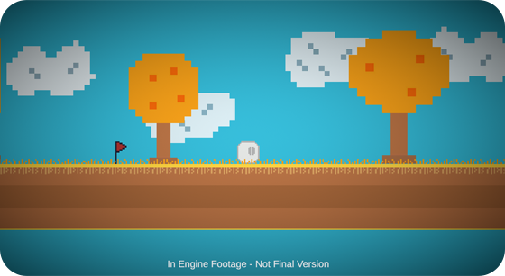

# Who are we?
Hello! we're Pixel Barrels, a project made to create new experiences that players can enjoy and remember. We're the developers behind the ShapeWorld series and we're currently developing the last game of the ShapeWorld series, ShapeWorld: FightLand.

# Our projects
As we said before, we're developers of the ShapeWorld series, the ShapeWorld series consists in five games:

* The Duck Bomb
* ShapeWorld: Origins
* ShapeWorld: After Origins
* Fall To Hell
* ShapeWorld: FightLand

(You can find those games [here](../../games.html))

Those games are connected and take place in the same universe but the main games of the ShapeWorld series are ShapeWorld: Origins, ShapeWorld: After Origins and ShapeWorld: FightLand.

The ShapeWorld series is close to it's end but all our past and future games will be connected.

# Future
Currently, we're developing ShapeWorld: FightLand, the development started in December 2023 and is our biggest game at this moment, [a trailer was released months ago](https://youtu.be/vyIgHrNujlE?si=XNxa2ue3Gkag1Y0H) but the game has changed a lot since the release of that trailer so you will have to wait until the next announcement.

ShapeWorld: FightLand will be released as an Early Access, featuring the first two zones with an open-world gameplay. We hope our players will enjoy this game.

# This blog
We're making announcements in this format to reach more players across different platforms, so expect more content in this format related to our games, new announcements and behind the scenes.

# See you later!
Thank you for reading this short entry, in the future we want to talk about different topics related to our games so please, look forward to our future content! Thanks!

